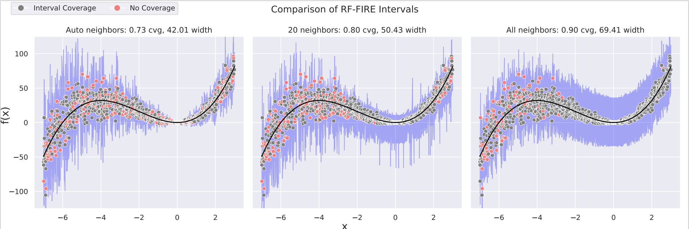
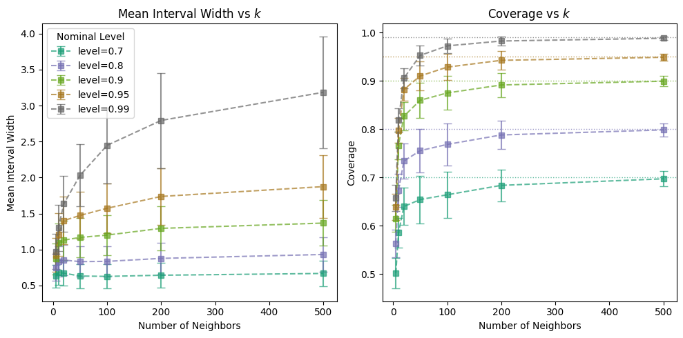
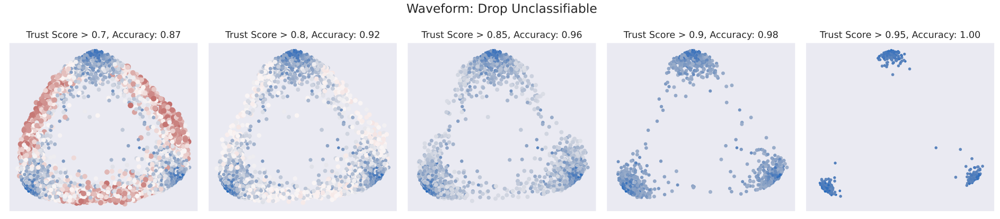

# RF‑Uncertainty‑ICMLA  

This repository contains implementation, data, and experimental scripts for the paper **"Localized Uncertainty Quantification in Random Forests via Proximities"**. It provides tools to build prediction intervals for regression, trust / uncertainty measures for classification, using Random Forest proximities (RF‑GAP).

---

## Overview

Many applications require not just predictions, but a sense of *how certain* those predictions are. Standard global metrics (such as MSE or accuracy) do not inform you about local uncertainty: are we confident about a given prediction, or “in unfamiliar territory”?  

This work introduces methods to quantify localized uncertainty in Random Forests using **proximity metrics**—i.e. how similar (in terms of RF paths / leaf assignments) new points are to training points. Two main tools are proposed:

- **RF‑FIRE** (Random Forest Interval Residual Estimation) — for regression: creates prediction intervals whose widths adapt based on how “familiar” a point is (via its proximity neighborhood).  
- **RF‑ICE** (Random Forest Instance Classification Evaluation) — for classification: produces trust or confidence scores per instance, allowing us to flag low‐confidence / likely misclassified points, and optionally reject them to improve overall performance.

These methods leverage Out‑of‑Bag (OOB) errors and proximities to establish local neighborhoods without needing an external held‐out set.

---

## Methods

Here’s a summary of how the methods work, based on the paper + repository implementation:

| Method | Purpose | Key Steps / Components |
|---|---|---|
| **RF‑GAP** | Define a notion of “local neighborhood” in feature space via random forests | Proximity between two points is how often they end in same leaf across trees (OOB or in forest). These proximities enable weighting or selecting neighbors for local error distributions. |
| **RF‑FIRE** (Regression Intervals) | Build prediction intervals that adapt to local error behavior | 1. For each training point, gather OOB residuals of its proximate neighbors.  <br>2. For a test point, compute its proximity to training points, get weighted residuals / neighborhood residuals. <br>3. Construct interval bounds (e.g. quantiles) from those residuals. <br>4. Varying the neighborhood size (k nearest in proximity, or threshold) trades off local adaptivity vs coverage. |
| **RF‑ICE** (Classification Trust) | Produce per‐instance “trust” scores so as to flag possibly unreliable predictions; enable rejection | Two variants presented:  <br>• **EMR** (Expected Misclassification Rate) / similar: use OOB misclassifications weighted by proximities. <br>• **Conformity**: looking at class‑wise proximities / how strongly the nearest neighbors support the predicted class vs alternatives. <br>Use these trust scores to define *unclassifiable* instances; removing or rejecting those increases precision / accuracy on remaining points. |

Implementation details found in the repo:

- The folder `rfgap/` implements the proximity computations and core functions.  
- `methods/` includes the procedures for the compared methods.  
- `runners/` contains scripts to run experiments on datasets.  
- `datasets/` stores or links to datasets used in benchmarks.  
- `figures/` stores plot files used for the paper/repository.  

---

## Getting Started

### Prerequisites

- Python 3.9+  
- Packages listed in `requirements.txt` (e.g. `numpy`, `scikit-learn`, etc.)

### Installation

```bash
git clone https://github.com/rhodes-byu/RF-Uncertainty-ICMLA.git
cd RF-Uncertainty-ICMLA
pip install -r requirements.txt
```

---

## Usage

### Usage at a Glance

- **`predict_with_intervals` (regression)**  
  Generates localized prediction intervals using OOB residuals and proximities (RF-FIRE).  
  - Inputs: `X_test` (optional), `n_neighbors` (`'auto'`, `'all'`, or int), `level` (confidence).  
  - Output: `(y_lower, y_pred, y_upper)` per sample.  
  - Notes: Requires regression with `oob_score=True`; smaller `k` → tighter, local intervals.

- **`get_instance_classification_expectation` (classification)**  
  Computes per-instance trust scores (RF-ICE EMR) from proximities and OOB correctness.  
  - Inputs: `x_test`, `y_test` (optional).  
  - Output: dict with `{'train': scores, 'test': scores}`; also AUC metrics if labels given.  
  - Notes: Requires classification, `prox_method='rfgap'`, `oob_score=True`, `non_zero_diagonal=False`.

- **`get_nonconformity` (classification)**  
  Calculates conformity/nonconformity scores via class-wise proximity ratios.  
  - Inputs: `k` (neighbors), `x_test`, `y_test`, optional `proximity_type`.  
  - Output: nonconformity & conformity scores, quantiles, AUC metrics (train/test).  
  - Notes: For classification; scores can be used to rank or reject low-confidence points.

---

## Figures

### Figure 1  
**Title:** RF‑FIRE intervals across different neighborhood sizes  
**Caption / Description:** Comparison of prediction intervals produced by RF‑FIRE when using different numbers of proximate neighbors. The intervals adapt—smaller neighborhoods produce tighter intervals where data is dense / low noise; larger neighborhoods produce wider intervals for coverage.



### Figure 2  
**Title:** Interval width & coverage as function of neighborhood size  
**Caption / Description:** Plots showing how mean interval width increases with increasing neighborhood size, while coverage approaches desired target. Demonstrates the trade‑off and tuning possibilities.



### Figure 3  
**Title:** RF‑ICE trust scoring / rejection curves for classification  
**Caption / Description:** The points are sized and colored by their associated RF-ICE trust score. Red, large points are associated with lower trust, while blue, smaller points have higher trust. We sequentially remove unclassifiable points according to the set thresholds of RF-ICE trust scores and the random forest model accuracy is recorded for each subset. The model accuracy improves as more unclassifiable points are removed.


---

## Citation & License

If you use this code or build on it, please cite:

```
@inproceedings{RFUncertainty2025,
  title={Localized Uncertainty Quantification in Random Forests via Proximities},
  booktitle={Proceedings of the International Conference on Machine Learning and Applications (ICMLA)},
  year={2025},
  author={Rhodes, Jake S. and Brown, Scott D. and Wilkinson, J. Riley}
}
```

---

## Contact

Pull requests are welcome. Also feel free to reach Jake Rhodes at rhodes@stat.byu.edu.
